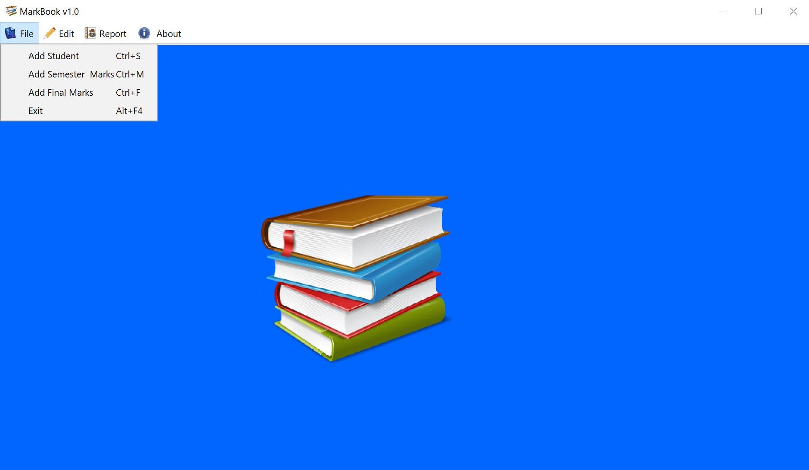

# Student Information System Desktop Application

The following desktop application is Student Information System (SIS) designed to assist teachers with adding students to a database, and calculating their marks in a given class for a particular semester. At the end of the semester, student are given a final grade. The teacher can also print all of the grade of each student to a pdf file. Below a list of features, an image showing a screenshot of the mainscreen of the GUI application, and the list of dependencies.

 

## Features
* Splash screen
* Add students to a database
* Add semester marks for a student
* Add final marka for a student
* Edit Student marks
* Student List
* Student Grade Report
* About page

 

## Images

  

## Languages/Dependencies
* Java
* SQL
* Jasperreports library
